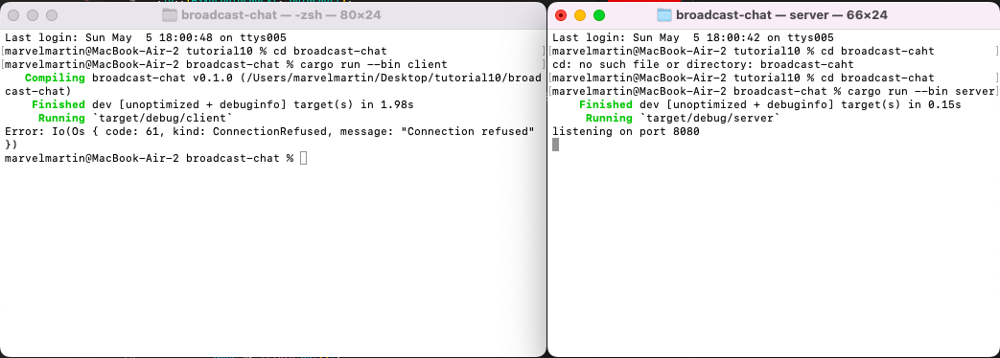
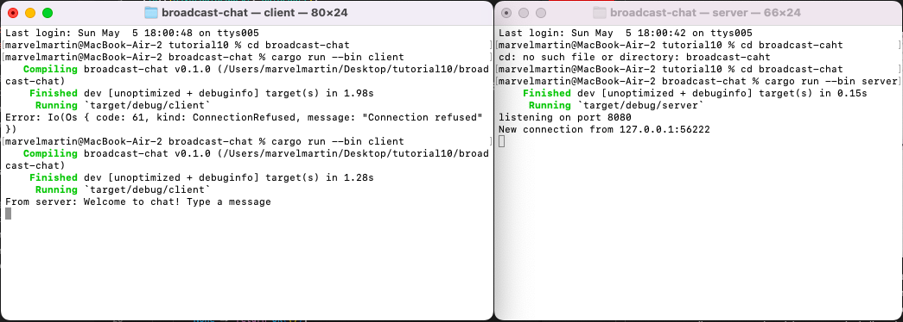

# Tutorial 10 - broadcast-chat
AdvPro B - Marvel Martin Everthard - 2206081345

## 2.1. Original code of broadcast chat.


Dari gambar di atas, saya menjalankan server dengan perintah `cargo run --bin server` pada satu terminal dan menjalankan 3 client dengan perintah `cargo run --bin client` pada 3 terminal yang berbeda. Ketiga client tersebut terkoneksi pada satu server sehingga ketika saya mengetik sesuatu pada salah satu terminal client, ketikan tersebut akan diterima server dan dilanjutkan ke client yang lain sehingga pada terminal client yang lain dapat terlihat ketikan tersebut juga.

## 2.2. Modifying the websocket port.
- _**Hanya mengubah websocket port pada server**_

- _**Mengubah websocket port pada server dan client**_


Dari kedua gambar di atas, dapat terlihat perbedaan antara mengubah websocket port pada sisi server saja dengan mengubah websocket port pada sisi server dan client. Jika hanya mengubah pada salah satu sisi, maka akan terjadi error dan program akan terminate. Hal ini dikarenakan client tidak dapat menemukan port yang tepat. Oleh karena, perubahan websocket harus dilakukan pada kedua sisi sebagai berikut.
- Sisi server pada `src/bin/server.rs`
    ```rust
    let listener = TcpListener::bind("127.0.0.1:8080").await?;
    println!("listening on port 8080");
    ```

- Sisi client pada `src/bin/client.rs`
    ```rust
    let (mut ws_stream, _) =
        ClientBuilder::from_uri(Uri::from_static("ws://127.0.0.1:8080"))
            .connect()
            .await?;
    ```