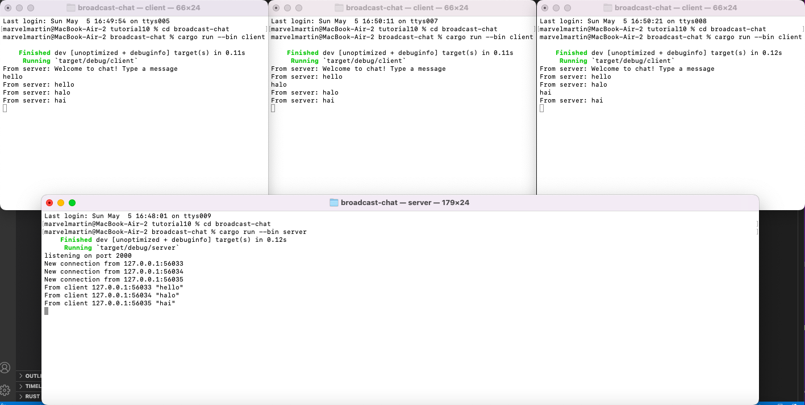

# Tutorial 10 - broadcast-chat
AdvPro B - Marvel Martin Everthard - 2206081345

## 2.1. Original code of broadcast chat.

Dari gambar di atas, saya menjalankan server dengan perintah `cargo run --bin server` pada satu terminal dan menjalankan 3 client dengan perintah `cargo run --bin client` pada 3 terminal yang berbeda. Ketiga client tersebut terkoneksi pada satu server sehingga ketika saya mengetik sesuatu pada salah satu terminal client, ketikan tersebut akan diterima server dan dilanjutkan ke client yang lain sehingga pada terminal client yang lain dapat terlihat ketikan tersebut juga.